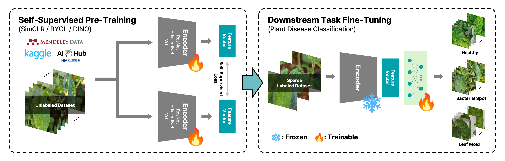

# LeafVision
By Yunseok Han, Woosang Jeon, Taehyeong Kim*



## Introduction
Plant disease diagnosis in real-world settings often suffers from scarce labeled data and domain gaps when using general-purpose ImageNet-pretrained backbones. **LeafVision** is a domain-specific, self-supervised (SSL) agricultural vision foundation model pretrained on **540,013 leaf images**. We evaluate **SimCLR, BYOL, DINO** across **ResNets, EfficientNets, and ViTs**, showing consistent gains over ImageNet baselines—especially in data-scarce regimes (e.g., **5 images/class**).

Key takeaways:
- Domain-specific SSL pretraining >> ImageNet pretraining for plant disease classification
- Gains are **architecture-agnostic** (CNNs and ViTs)
- Strong performance persists **even with abundant labels**

## Datasets for self-supervised pretraining

We integrated 13 publicly available plant disease datasets spanning diverse crops, diseases, and imaging conditions. These datasets provide 540K leaf images that form the basis of LeafVision’s self-supervised pretraining, ensuring broad coverage and robustness across species and real-world scenarios.

| Dataset | Description | Link |
|---------|-------------|------|
| PlantVillage (G. and J. 2019) | 61,486 images, 38 groups by species and disease status. | [Link](https://data.mendeley.com/datasets/tywbtsjrjv/1) |
| PlantDoc (Singh et al. 2020) | 2,598 images, 13 species, up to 17 disease classes. | [Link](https://github.com/pratikkayal/PlantDoc-Dataset) |
| Plant Pathology 2020 (Thapa et al. 2020) | 3,642 apple leaf images, expert-annotated for ML detection. | [Link](https://www.kaggle.com/c/plant-pathology-2020-fgvc7/data) |
| Cassava (Tusubira et al. 2022) | 21,367 cassava leaf images, 4 diseases + healthy class. | [Link](https://www.kaggle.com/competitions/cassava-leaf-disease-classification/data) |
| Citrus Fruits & Leaves (Sharif et al. 2018) | 759 citrus fruit/leaf images, healthy and diseased. | [Link](https://data.mendeley.com/datasets/3f83gxmv57/2) |
| Rice Leaf (Prajapati et al. 2017) | 120 images, Bacterial Leaf Blight, Brown Spot, Leaf Smut. | [Link](https://www.kaggle.com/datasets/vbookshelf/rice-leaf-diseases) |
| DeepWeeds (Olsen et al. 2019) | 17,509 images, 8 Australian weed species in situ. | [Link](https://www.kaggle.com/datasets/imsparsh/deepweeds) |
| Plant Disease Recognition (Kaggle)¹ | 1,530 images, Healthy, Powdery, Rust; with splits. | [Link](https://www.kaggle.com/datasets/rashikrahmanpritom/plant-disease-recognition-dataset) |
| PlantifyDr (Kaggle)² | 124,636 images, 10 plant types, 37 diseases. | [Link](https://www.kaggle.com/datasets/lavaman151/plantifydr-dataset) |
| Cucumber Plant Disease (Kaggle)³ | 691 images, labeled ill/good; train/test splits. | [Link](https://www.kaggle.com/datasets/kareem3egm/cucumber-plant-diseases-dataset) |
| Plant Disease Classification (Kaggle)⁴ | 1,472 images, Healthy, Powdery, Rust; identical splits. | [Link](https://www.kaggle.com/code/vad13irt/plant-disease-classification/input) |
| Plant Disease Inducing Integrated Data (AIHub)⁵ | 113,054 images, 6 crops with healthy, disease, disorder, protective-agent labels. | [Link](https://www.aihub.or.kr/aihubdata/data/view.do?currMenu=115&topMenu=100&aihubDataSe=data&dataSetSn=525) |
| Strawberry Disease Detection (AIHub)⁶ | 191,149 strawberry images for real-time diagnosis. | [Link](https://www.aihub.or.kr/aihubdata/data/view.do?currMenu=115&topMenu=100&aihubDataSe=data&dataSetSn=71451) |


## Results

> **Evaluation protocol (summary)**  
> • Linear evaluation: single FC head on frozen encoder; 200 epochs; best of LRs {1e-4, 5e-4, 1e-3, 5e-3}; 10 runs (mean ± std).  
> • k-NN: cosine similarity, **k=10**, **temperature T=0.07** (temperature-scaled softmax voting).

### 1) SSL method comparison (ResNet-50 @ PlantVillage, data-scarce)
**05 images/class** (most challenging) — LeafVision improves dramatically across SSL methods.

| SSL | Pretrain | Acc (%) | F1 (%) | 10-NN Acc (%) |
|---|---|---:|---:|---:|
| SimCLR | ImageNet | 23.20 ± 0.88 | 21.95 ± 1.05 | 14.94 |
| SimCLR | **LeafVision** | **87.46 ± 0.14** | **87.34 ± 0.16** | **80.46** |
| BYOL | ImageNet | 78.08 ± 0.28 | 78.50 ± 0.23 | **73.50** |
| BYOL | **LeafVision** | **79.57 ± 0.18** | **80.42 ± 0.16** | 50.78 |
| DINO | ImageNet | 83.52 ± 0.29 | 83.62 ± 0.28 | 75.93 |
| DINO | **LeafVision** | **94.64 ± 0.20** | **94.69 ± 0.21** | **93.45** |

> At **15/30 images/class**, LeafVision remains ahead; with **DINO**, Acc↑ to **97.68/98.53%** vs ImageNet **91.21/94.64%**.

### 2) Backbone comparison (DINO @ PlantVillage)
LeafVision gains are **architecture-agnostic** (numbers below show **30 images/class**).

| Backbone | Pretrain | Acc (%) | 10-NN Acc (%) |
|---|---|---:|---:|
| ResNet-18 | ImageNet† | 30.58 ± 1.42 | 35.05 |
| ResNet-18 | **LeafVision** | **97.37 ± 0.06** | **96.64** |
| ResNet-50 | ImageNet | 94.64 ± 0.07 | 89.07 |
| ResNet-50 | **LeafVision** | **98.53 ± 0.06** | **97.56** |
| EfficientNet-B0 | ImageNet† | 89.02 ± 0.10 | 15.30 |
| EfficientNet-B0 | **LeafVision** | **98.14 ± 0.04** | **96.61** |
| EfficientNet-B2 | ImageNet† | 86.88 ± 0.19 | 15.74 |
| EfficientNet-B2 | **LeafVision** | **98.48 ± 0.04** | **97.26** |
| ViT-S/16 | ImageNet | 94.47 ± 0.16 | 89.47 |
| ViT-S/16 | **LeafVision** | **98.26 ± 0.06** | **96.78** |
| ViT-B/16 | ImageNet | 95.84 ± 0.07 | 89.93 |
| ViT-B/16 | **LeafVision** | **98.26 ± 0.11** | **96.85** |

† Torchvision SL checkpoints.

### 3) Crop-specific & multi-crop (DINO, ResNet-50, **05 images/class**)
LeafVision generalizes to **real-world crop datasets**; largest jump on **Tomato**.

| Dataset | Pretrain | Acc (%) | F1 (%) | 10-NN Acc (%) |
|---|---|---:|---:|---:|
| PlantVillage | ImageNet | 83.52 ± 0.29 | 83.62 ± 0.28 | 75.93 |
| PlantVillage | **LeafVision** | **94.64 ± 0.20** | **94.69 ± 0.21** | **93.45** |
| Cucumber | ImageNet | 81.98 ± 0.96 | 82.75 ± 0.94 | 81.44 |
| Cucumber | **LeafVision** | **89.18 ± 0.96** | **89.91 ± 0.97** | **90.67** |
| Pepper | ImageNet | 82.06 ± 0.91 | 82.68 ± 0.87 | 79.81 |
| Pepper | **LeafVision** | **87.78 ± 0.75** | **88.41 ± 0.76** | **85.19** |
| Tomato | ImageNet | 88.19 ± 0.68 | 88.63 ± 0.70 | 87.95 |
| Tomato | **LeafVision** | **96.06 ± 0.24** | **96.60 ± 0.25** | **96.24** |
| Multi-Crop (9-cls) | ImageNet | 81.02 ± 0.51 | 82.18 ± 0.35 | 79.89 |
| Multi-Crop (9-cls) | **LeafVision** | **83.97 ± 0.60** | **86.43 ± 0.61** | **90.24** |

> In Multi-Crop, **k-NN gains are large**, suggesting robust feature space; linear head may be a bottleneck for multi-crop complexity.

### 4) Abundant data (full PlantVillage)
Gains persist even with plentiful labels.

| Pretrain | Acc (%) | F1 (%) | 10-NN Acc (%) |
|---|---:|---:|---:|
| ImageNet | 97.86 ± 0.19 | 97.54 ± 0.25 | 98.13 |
| **LeafVision** | **98.35 ± 0.15** | **98.03 ± 0.17** | **99.58** |

## Example code
See `example.ipynb` to train a linear classifier on PlantVillage 05images using our **pretrained ResNet-50**.

## Models
| SSL | Model | Path |
|---|---|---|
| SimCLR | ResNet-18 | `./models/LeafVision_SimCLR_resnet18.pth` |
| SimCLR | ResNet-50 | `./models/LeafVision_SimCLR_resnet50.pth` |
| BYOL | ResNet-50 | `./models/LeafVision_BYOL_resnet50.pth` |
| DINO | ResNet-18 | `./models/LeafVision_DINO_resnet18.pth` |
| DINO | ResNet-50 | `./models/LeafVision_DINO_resnet50.pth` |
| DINO | EfficientNet-B0 | `./models/LeafVision_DINO_efficientnet_b0.pth` |
| DINO | EfficientNet-B2 | `./models/LeafVision_DINO_efficientnet_b2.pth` |
| DINO | ViT-S/16 | `./models/LeafVision_DINO_vit_small.pth` |
| DINO | ViT-B/16 | `./models/LeafVision_DINO_vit_base.pth` |

## Citing
If you find this code useful in your research, please consider citing:

```bibtex
@misc{han2025leafvision,
  title={LeafVision: Self-Supervised Agricultural Vision Foundation Models for Plant Disease Classification},
  author={Yunseok Han and Woosang Jeon and Taehyeong Kim},
  url={https://github.com/LABA-SNU/LeafVision},
  year={2025},
}